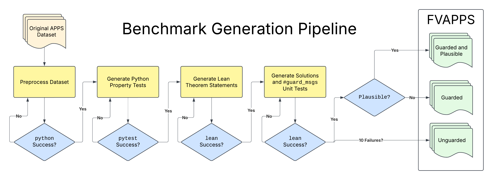

# Proving the Coding Interview: Formally Verified APPS

At ICSE 2025's LLM4Code workshop.

### [Paper](https://drive.google.com/file/d/1fmx0NaKKzvH5gcFFNMJLL9BW2gMIbFkc/view?usp=sharing)



Lifting [APPS](https://github.com/hendrycks/apps) to Lean with LLM-generated theorem statements.

[HuggingFace](https://huggingface.co/datasets/quinn-dougherty/fvapps):
``` python
datasets.load_dataset("quinn-dougherty/fvapps")
```

## Reproducing our baselines

Install `elan`, `rye`, do your `$PATH` munging, and source `.venv/bin/activate`.

First, you need to install mathlib with `lake update`. This will pull the mathlib precompile cache, too, but if it doesn't and you find yourself waiting for mathlib to compile, run `lake exe cache get` in the lake project.

`--model {llama,prover-rl}` require local GPU, the others require API keys.

```
$ rye sync
$ cd artefacts/baselines/solve-fvapps
$ lake update
$ cd ./../../../
$ rye run baselines --help
usage: FVApps Baselines [-h] [--model {sonnet,o1-mini,gemini,prover-rl,llama,testhf}] [--split {train,test}]
                        [--start_idx START_IDX] [--end_idx END_IDX]

options:
  -h, --help            show this help message and exit
  --model {sonnet,o1-mini,prover-rl,llama,testhf}
                        model name (default: sonnet)
  --split {train,test}  train or test (default: train)
  --start_idx START_IDX
                        index to start pulling from apps
  --end_idx END_IDX     index to end pulling from apps (inclusive)
```

## How to regenerate the benchmark

### Setup

install `elan` and install/update to a nightly toolchain. Install `rye`.

```
rye sync
. .venv/bin/activate
```

Sourcing the `.venv` will make sure we're not relying on `pytest` executable to have been installed in the global machine.

Create a `.env` file with the following:
```
ANTHROPIC_API_KEY="YOUR_KEY_HERE"
```

On the linux server you'll need to install `parallel`, maybe `screen`.

### Preprocess

First, we preprocess `apps` solutions

```
$ rye run preprocess --help
usage: preprocess [-h] [--split SPLIT] [--start_idx START_IDX] [--end_idx END_IDX]

options:
  -h, --help            show this help message and exit
  --split SPLIT         Train or test split. Default: train.
  --start_idx START_IDX
                        Start index for the dataset.
  --end_idx END_IDX     End index for the dataset.
```

They'll populate in `artefacts/apps/train/{i}`

### Spec generation

Then, two agents will generate property tests and sorry'd out lean theorems, respectively.

```
$ rye run fvapps --help
usage: FV-APPS full generation run [-h] [--split SPLIT] [--start_idx START_IDX] [--end_idx END_IDX]
                                   [--skip_lean] [--skip_python]

options:
  -h, --help            show this help message and exit
  --split SPLIT         train or test (default: train)
  --start_idx START_IDX
                        index to start pulling from apps
  --end_idx END_IDX     index to end pulling from apps
  --skip_lean           skips lean when present
  --skip_python         skips python when present
```

`rye run fvapps --skip_lean` depends on `rye run preprocess` to have been run before, and `rye run fvapps --skip_python` depends on both the preprocessing step and the fvapps python step to have been run before. (`FileNotFoundError` will guide you toward this understanding regardless)

### Quality assurance

```
$ rye run qa_autoformalize
$ rye run qa_plausible
```

### Postprocess

The last thing is to trim up the artefacts to their huggingface form.
```
rye run postprocess
```
